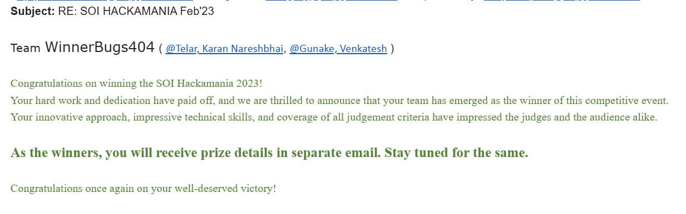

# Travelling Fun Factor calculator

Problem statement:
Travel/Adventure plays a very important role in individual life. ​

The experience at destination depends upon the time spent in that location and duration in covering distance between core location to destination. Bad path and planning sometimes ruins the memory associated with places.​

There are different portals exist to make sure less time travel and maximize the time in location itself. While in such competitive market, every player seeks its own profit and not concerned about the experience. ​

The main goal of the solution proposed should be to develop a solution which aims at minimum cost spent in travelling/Staying and covering maximum locations with higher fun quotient and eventually highest FUN FACTOR (FUN QUOTIENT/COST associated) ​

Activities can be extended , so are the locations.​

Solution instruction to run file:
Run make command in make folder so that all the bin files get build and at the end run the exe file from bin folder and give specific inputs.

Data is csv form is stored in data folde

command to run files:

1. soihktn> cd make
2. soihktn\make> make
3. soihktn\make> cd ..
4. soihktn> cd bin
5. soihktn\bin> .\runmain.exe

Thankyou
